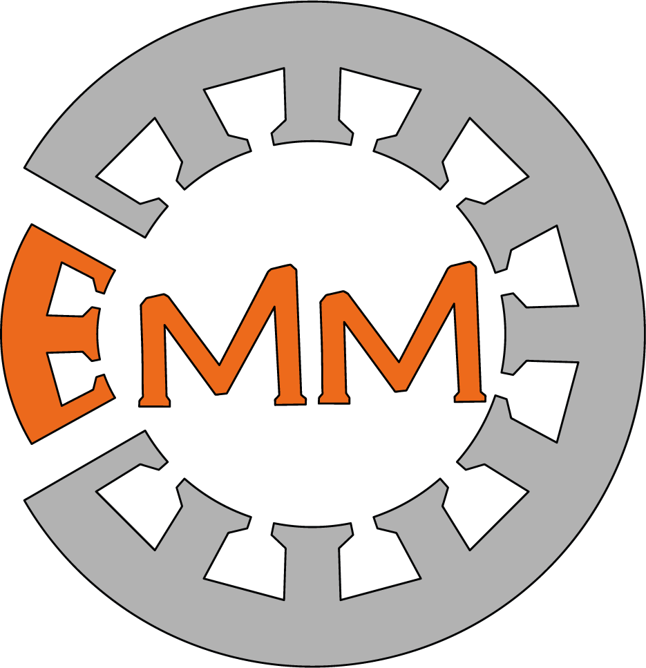

<!--
Copyright (c) 2018-2024 M. Schuler, TTZ-EMO, Technical University of Applied Sciences Wuerzburg-Schweinfurt.

This file is part of PyEMMO
(see https://gitlab.ttz-emo.thws.de/ag-em/pyemmo).

This program is free software: you can redistribute it and/or modify
it under the terms of the GNU General Public License as published by
the Free Software Foundation, either version 3 of the License, or
(at your option) any later version.

This program is distributed in the hope that it will be useful,
but WITHOUT ANY WARRANTY; without even the implied warranty of
MERCHANTABILITY or FITNESS FOR A PARTICULAR PURPOSE.  See the
GNU General Public License for more details.

You should have received a copy of the GNU General Public License
along with this program. If not, see <http://www.gnu.org/licenses/>.
-->

<!-- This is a comment -->
<!-- This is a simple example package. You can use
[Github-flavored Markdown](https://guides.github.com/features/mastering-markdown/)
to write your content. -->

<!--  -->
<p align="center">

</p>


# PyEMMO
_**Py**thon **E**lectrical **M**achine **M**odelling in **O**NELAB_

PyEMMO is a interface for modeling electrical machines in the open-source FEA software [ONELAB](https://onelab.info/).
The goal of the project is to automate model creation and the simulation workflow for electrical machines with ONELAB.
<!-- That's why it name stands for **Py**thon **E**lectrical **M**achine **M**odelling in **O**NELAB -->


## Installation

Use the package manager [pip](https://pip.pypa.io/en/stable/) to install PyEMMO.

```bash
pip install https://github.com/ttz-emo/pyemmo.git
```

You will need versions of [Gmsh](https://gmsh.info/) and [GetDP](https://getdp.info/) executables. While Gmsh can be directly installed from pip with the Gmsh Python-API, you will need to download GetDP individually.
> [!WARNING]
> Models created with PyEMMO fail with current GetDP version 3.6.0 due to mesh import error!
> You can check your GetDP version with  ``getdp --version``

## Usage

The easiest way to start is by using the [PYLEECAN](https://github.com/Eomys/pyleecan) project to create a electrical machine instance and feeding it into the PyEMMO-PYLEECAN interface.
- Have a look at the [PYLEECAN tutorials](https://pyleecan.org/tutorials.html) on how to use PYLEECAN. Especially the tutorial on ["How to define a machine"](https://pyleecan.org/01_tuto_Machine.html).
- See the [PYLEECAN API tutorial](tutorials/pyleecan_api.py) for detailed instructions on how to create a ONELAB model from a PYLEECAN machine object.

Here is a small example of the PYLEECAN API:

```python
from os.path import join

from pyemmo.api.pyleecan import main as pyleecan_api
from pyleecan.definitions import DATA_DIR
from pyleecan.Functions.load import load

# load a pyleecan machine
IPMSM_A = load(join(DATA_DIR, "Machine", "Toyota_Prius.json"))

# Run the main function of the pyleecan api:
pyemmo_script = pyleecan_api.main(
    pyleecan_machine=IPMSM_A,
    model_dir="./Toyota_Prius_ONELAB",  # path for the model files
    use_gui=True,  # select if you want to open the final model in Gmsh.
    gmsh="",  # optional gmsh executable.
    # If use_gui is True, pyemmo will try to find a Gmsh executable on your computer.
    getdp="",  # optional getdp executable. For simulation in the GUI.
)
```
## Contributing

Pull requests are welcome. For major changes, please open an issue first
to discuss what you would like to change.

Please make sure to update tests as appropriate.

### Setup

After cloning the repository you should install pre-commit package using ``pip install pre-commit``.
After that please update the ``INSTALL_PYTHON`` path in the pre-commit hook under "./workingDirectory/pre-commit".
Then run the following command to install the Git hooks:

```sh
./workingDirectory/install-hooks.sh
```

Or if you are on Windows:

```sh
install-hooks.bat
```
These hooks make sure you have formatted your files correctly.

## License

[GPLv3](https://www.gnu.org/licenses/gpl-3.0.html)

## Publications

- [2023: PyEMMO - a Python based software for the finite element modelling of electrical machines in ONELAB](https://nbn-resolving.org/urn:nbn:de:bvb:863-opus-55489)


## Run Sphinx to create Documentation

To create or update the documentation you will need to do:

1. Install the doc requirments with: `pip install -r requirements-doc.txt`.
2. Make sure pyemmo is found by either creating a *pyemmo.pth* file in the *site-packages* folder or use `pip install -e .`.
3. To fully build the documentation including the PYLEECAN api subpackage you need to install PYLEECAN. Currently we have to use the Github version since there is no new release yet: `pip install git+https://gitlab.com/Eomys/pyleecan/tree/update-python-version.git`
4. Run Sphinx to build the docs e.g. in html `doc\make.bat html`.

You can run `doc\make.bat` plane to see the build options.
Futher information on building the documentation can be found in the [Sphinx documentation](https://www.sphinx-doc.org/en/master/tutorial/index.html).
