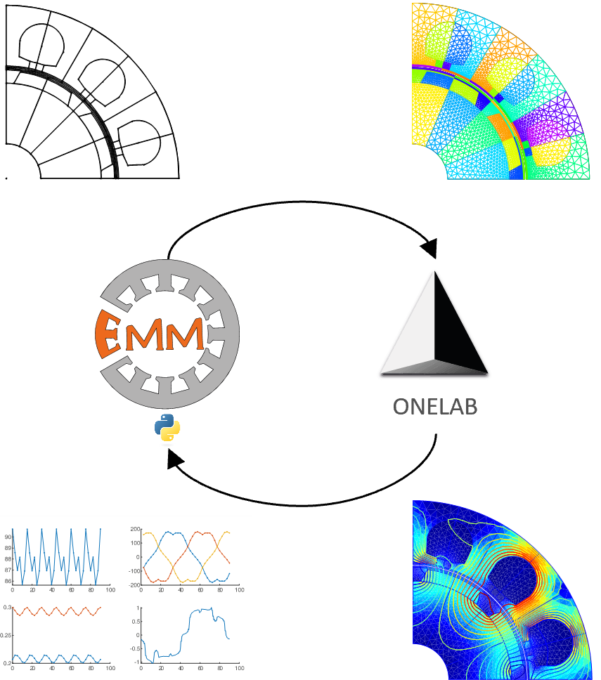

Welcome to the PyEMMO documentation!
=====================================

**PyEMMO is a Python based software for generating finite element models of
electrical machines in** `ONELAB <onelab_link>`_.

   Workflow of PyEMMO Model Generation and ONELAB Simulation

What is PyEMMO
==============

**PyEMMO is a Python library for the automated modeling of electrical machines in the
Open-Source finite element software** `ONELAB <onelab_link>`_.

The projects motivation is to **reduce license costs** and accelerate standard tasks
through **parallelization of calculations**.

Its goal is to create a **Open-Source alternative for the calculation of electrical
machines** and serve as a central memory for the methods developed in the
`research group for electrical machines (AG-EM) <https://ttz-emo.thws.de/arbeitsgruppen/elektrische-maschinen/>`_
at `TTZ-EMO <https://ttz-emo.thws.de/>`_.
furthermore it shall encourage to developed new calculation methods in the field of
electrical machines.

Features
========
Current features are:

* Fully coupled to ONELAB to perform **static, harmonic and transient electromagnetic simulations**. Model files (.geo for Gmsh and .pro for GetDP) can be created through

   * **Universal interface** either from user defined scripted geometry definition or based on json-formatted input files.
   * Coupling to `Pyleecan project <https://pyleecan.org/>`_.

* Built-in material database.
* Various functions to:

   * Run ONELAB simulations through Python based on Subprocesses.
   * Automatically import GetDP results from result files.
   * Evaluate individual core loss depended on GetDP field results.

.. toctree::
   :maxdepth: 2
   :caption: Contents

   source/usage
   source/gen/pyemmo
   source/wiki

Publications
============

- `PyEMMO - a Python based software for the finite element modelling of electrical machines in ONELAB <https://nbn-resolving.org/urn:nbn:de:bvb:863-opus-55489>`_

Indices and tables
==================

* :ref:`genindex`
* :ref:`modindex`
* :ref:`search`

.. _onelab_link: https://www.onelab.info/
.. _Pyleecan: https://pyleecan.org/
