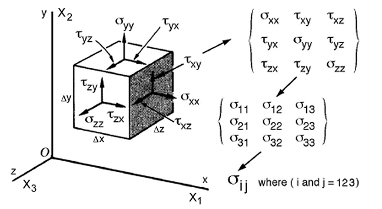
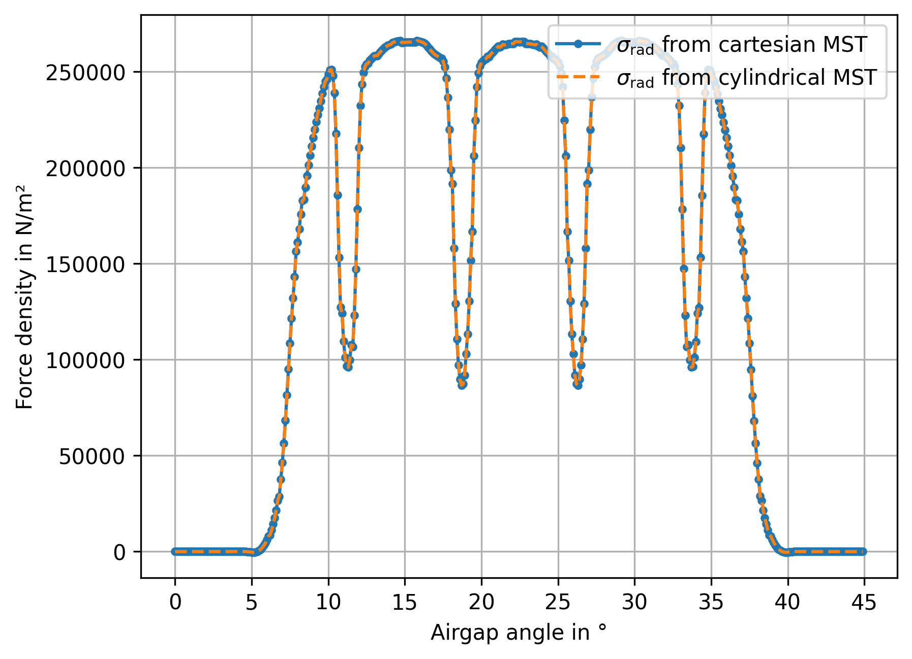
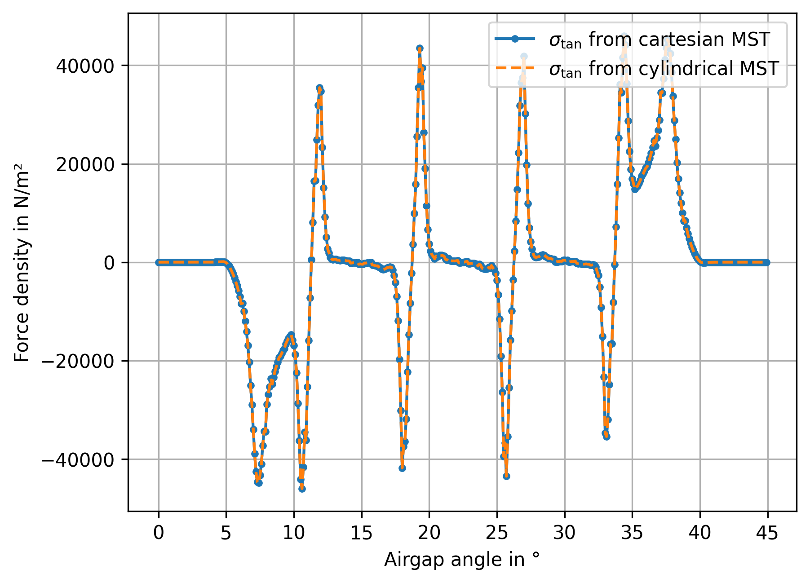

# Calculation of force density with Maxwell Stress Tensor

The **Maxwell stress tensor** (MST) is a convenient way to compute the mechanical forces produced by electromagnetic fields.
Instead of directly calculating forces on charges and currents, it describes how electromagnetic fields transfer **momentum** and exert **stress** (pressure and shear) on surfaces.

---

## 1. Physical Idea

Electromagnetic fields store **energy and momentum**.
Where the field interacts with matter or boundaries, this momentum flow results in **forces**.

The Maxwell stress tensor \( \mathbf{T} \) represents the **electromagnetic stress (force per area)** acting on a surface.

Its unit is:

\[
\text{Pa} = \frac{\text{N}}{\text{m}^2}
\]

This is the same unit as mechanical pressure.

---

## 2. Force from the Maxwell Stress Tensor

The total force acting on an object can be calculated by integrating the stress tensor over a **closed surface** surrounding the object:

\[
\mathbf{F} = \oint_S \mathbf{T} \cdot \mathbf{n}\, dA
\]

where

- \( \mathbf{F} \) – total electromagnetic force
- \( \mathbf{T} \) – Maxwell stress tensor
- \( \mathbf{n} \) – outward normal vector of the surface
- \( dA \) – surface element

**Interpretation:**
The electromagnetic field exerts a pressure on every point of the surface, and integrating this pressure gives the total force.
While the main diagonal of the MST gives the pressure in each direction \(\sigma_{xx},\sigma_{yy},\sigma_{zz}\), the off-diagonal elements give the shear stress orthogonal to the surface normal \(\sigma_{xy},\sigma_{xz},...\).



---

## 3. Maxwell Stress Tensor (SI Units)

In vacuum, the tensor is

\[
T_{ij} =
\varepsilon_0 \left(E_iE_j - \frac{1}{2}\delta_{ij}E^2 \right)
+
\frac{1}{\mu_0}\left(B_iB_j - \frac{1}{2}\delta_{ij}B^2 \right)
\]

where

- \(E\) – electric field
- \(B\) – magnetic field
- \(\varepsilon_0\) – vacuum permittivity
- \(\mu_0\) – vacuum permeability
- \(\delta_{ij}\) – Kronecker delta (\(= 1\) if \(i==j\) otherwise \(0\))

For magnetostatic (or very low frequency) simulations we assume \(E\) to be zero in non-conducting domains. So the MST is simplified with only flux density field components:

\[
T_{ij} = \frac{1}{\mu_0}\left(B_iB_j - \frac{1}{2}\delta_{ij}B^2 \right)
\]

This general representation allows us to form the MST in cartesian **or** cylindrical coordinates both resulting in the same output quantities.

---

## Evaluating Force Density in ONELAB

In ONELAB the MST is given by the function
```
T_max[] = ( SquDyadicProduct[$1] - SquNorm[$1] * TensorDiag[0.5, 0.5, 0.5] ) / mu0 ;
```
where ``$1`` is replaced by the flux density \(\mathbf{B}\) at runtime.
To evaluate the airgap force density we simply multiply \(T_\mathrm{max}\) with unit vector radial direction ``Unit[ XYZ[] ]`` which is the normal vector on a cylindical airgap surface (in 3D; in 2D its a circle arc around the origin). Similar to section 2. but without the Integral.
To derive the radial and tangential components of the force density we have two options:

1. Directly create the MST with radial and tangential B-Field components
2. Transform the results of the MST in cartesian coordinates

The following will show, that both approaches yield the same results:

## 1. MST in cylindrical system

We skip the z-component in the following since we account for 2D simulations only.
The force density via the MST with \(i=\mathrm{rad}\) and \(j=\mathrm{tan}\) results in:
\[
\sigma_\mathrm{rad,tan} = T_\mathrm{rad,tan} \cdot \vec{e}_r
= T_\mathrm{rad,tan}  \cdot \begin{bmatrix} 1 \\ 0 \end{bmatrix} = \\
= \frac{1}{\mu_0}
\begin{bmatrix}
    \frac{1}{2}(B_\mathrm{rad}^2 - B_\mathrm{tan}^2) \ \ \ \
    B_\mathrm{rad}B_\mathrm{tan} \\
    B_\mathrm{rad}B_\mathrm{tan} \ \ \ \ \
    \frac{1}{2}(B_\mathrm{tan}^2 - B_\mathrm{rad}^2)
\end{bmatrix} \cdot \begin{bmatrix} 1 \\ 0 \end{bmatrix}
= \frac{1}{\mu_0}
\begin{bmatrix}
    \frac{1}{2}(B_\mathrm{rad}^2 - B_\mathrm{tan}^2) \\
    B_\mathrm{rad}B_\mathrm{tan}
\end{bmatrix}
\]

Be aware that the normal vector on a circle arc in the cylindrical coordinate system is \(\vec{e}_r=\begin{bmatrix} 1 \\ 0 \end{bmatrix}\).

So we get:
\[
\sigma_\mathrm{rad} = \frac{1}{2 \mu_0} (B_\mathrm{rad}^2 - B_\mathrm{tan}^2)\\
\sigma_\mathrm{tan} = \frac{1}{\mu_0} B_\mathrm{rad}B_\mathrm{tan}
\]
Which is consistent with literature [[1]](#1).

## 2. MST in cartesian system

For the cartesian coordinate system we can derive a similar expression for the MST with \(i=\mathrm{x}\) and \(j=\mathrm{y}\):
\[
\sigma_{x,y} = T_\mathrm{x,y} \cdot \vec{e}_r
= \frac{1}{\mu_0}
\begin{bmatrix}
    \frac{1}{2}(B_\mathrm{x}^2 - B_\mathrm{y}^2) \ \ \ \
    B_\mathrm{x}B_\mathrm{y} \\
    B_\mathrm{x}B_\mathrm{y} \ \ \ \ \
    \frac{1}{2}(B_\mathrm{y}^2 - B_\mathrm{x}^2)
\end{bmatrix} \cdot \vec{e}_r
\]

where the normal vector on a circle arc in cartesian coordinates is \(\vec{e}_r = \begin{bmatrix} cos(\vartheta) \\ sin(\vartheta) \end{bmatrix} \).

## 3. Comparison of the approaches

We would assume \(\sigma_\mathrm{rad,tan} = \mathrm{cart2cyl}(\sigma_{x,y})\). Therefore we compare the results of
\[
    \sigma_\mathrm{rad,cyl} = \frac{1}{2 \mu_0} (B_\mathrm{rad}^2 - B_\mathrm{tan}^2)\\
\]

with the radial component of the cartesian force density vector result

\[
    \sigma_\mathrm{rad,cart} = \sigma_\mathrm{x,y} \cdot \vec{n}_\mathrm{r}\\
\]

Note that the radial component of a vector (\(\sigma_\mathrm{x,y}\)) in cartesian coordintates is the scalar product of that vector with the unit vector in radial direction.
In GetDP the PostProcessing for these quantities looks like
```
...
Name MagStaDyn_a_2D; NameOfFormulation MagStaDyn_a_2D; NameOfSystem A;
PostQuantity {
    {
        Name Force_MST_Rad_Cart;
        Value{
            Term{
                [ CompRad[T_max[{Curl a}] * Unit[XYZ[]]] ];
                In Region[{Rotor_Airgap, Stator_Airgap}];
                Jacobian Vol;
            }
        }
    }
    {
        Name Force_MST_Rad_Cyl;
        Value{
            Term{
                [ 0.5/mu0 *(CompRad[{Curl a}]^2 - CompTan[{Curl a}]^2) ];
                In Region[{Rotor_Airgap, Stator_Airgap}];
                Jacobian Vol;
            }
...
```
where
``CompRad[] = $1 * Vector[  Cos[AngularPosition[]#4], Sin[#4], 0.];``
and
``CompTan[] = $1 * Vector[ -Sin[AngularPosition[]#4], Cos[#4], 0.];``.

The results of a test simulation show that both approaches give the same results while the deviation is on the order of the numerical accuracy:

<figure>
    
    <figcaption>Comparison of radial force density derived from different MST formulations.</figcaption>
</figure>

The same thing is true for the tangential component:

<figure>
    
    <figcaption>Comparison of tangential force density derived from different MST formulations.</figcaption>
</figure>


<!-- \[
\sigma = T_\mathrm{x,y} \cdot \vec{e}_r
= T_\mathrm{x,y}  \cdot \begin{bmatrix} cos(\vartheta) \\ sin(\vartheta) \end{bmatrix}
= \frac{1}{\mu_0}
\begin{bmatrix}
    \frac{1}{2}(B_\mathrm{x}^2 - B_\mathrm{y}^2) \ \ \ \
    B_\mathrm{x}B_\mathrm{y} \\
    B_\mathrm{x}B_\mathrm{y} \ \ \ \ \
    \frac{1}{2}(B_\mathrm{y}^2 - B_\mathrm{x}^2)
\end{bmatrix} \cdot \begin{bmatrix} cos(\vartheta) \\ sin(\vartheta) \end{bmatrix}
\] -->


<!-- =\\
= \frac{1}{\mu_0}
\begin{bmatrix}
    \frac{1}{2}(B_\mathrm{rad}^2 - B_\mathrm{tan}^2) \\
    B_\mathrm{rad}B_\mathrm{tan}
\end{bmatrix} -->
# References
<a id="1">[1]</a>  Bianchi, N. (2005). *Electrical machine analysis using finite elements*. Taylor & Francis.
