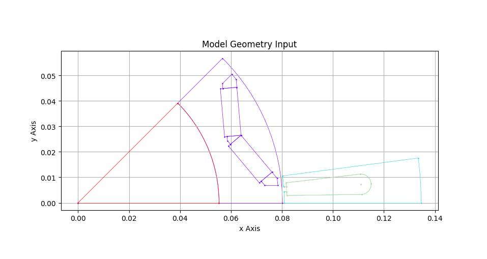

.. _section-pyemmo.api.json-package:

pyemmo.api.json package
=======================

.. toctree::
   :maxdepth: 1

This section is about the PyEMMO JSON API.
It's working with two `JSON <https://de.wikipedia.org/wiki/JavaScript_Object_Notation>`_ formatted files, giving the geometry and the additional machine information.
You can call the API via the command line using the following command:

.. code-block:: console

   $ python -m pyemmo.api.json /path/to/geo.json /path/to/machineInfo.json

Or you can use a Python script to execute the :func:`~pyemmo.api.json.json.main` function of the :mod:`~pyemmo.api.json.json` module, like this:

.. code-block:: python

   import os
   from pyemmo.api.json.json import main

   model_folder = r"/path/to/model/folder"
   param_file_path = os.path.join(model_folder, "param.json")
   model_file_path = os.path.join(model_folder, "geometry.json")
   # run json api to create ONELAB Model
   pyemmo_script = main(
      geo=model_file_path,
      extInfo=param_file_path,
      model=model_folder,
      gmsh="",
      getdp="",
      results="",
   )

The api returns a PyEMMO :class:`~pyemmo.script.script.Script` object, which is the core to create the model files for ONELAB.

Input Structure
---------------
The input to the json api are two structures (Python dictionaries or json files), one for the geometry and material definition of the individual machine surfaces and another one for the machine properties.
This section highlights the format of those two structures.

1. Geometry Structure
'''''''''''''''''''''
The geometry is defined by a list of segmented surface structures.
Every surface represents a minimal segment of the full model geometry.
The following picture shows an example of the segmented surface input for a simple IPMSM model geometry.

   Example of the surface segments of a IPMSM model geometry input for the JSON API.

Each surface segment has the following attributes:

.. list-table:: PyEMMO Segmented Surface Structure Attributes
   :header-rows: 1

   * - Attribute
     - Description
   * - Name
     - Surface name
   * - IdExt
     - Surface identifier defined in the api module :ref:`definitions <section-pyemmo.api.json>`
   * - Lines
     - Curve loop to draw the surface outline defined by a list of *line structures*
   * - Material
     - PyEMMO :class:`~pyemmo.script.material.material.Material` structure as dict.
   * - Quantity
     - Number of surface segments to form a full model (circle)
   * - Meshsize
     - Optional surface mesh size

Example dict structure for a stator lamination segment:

.. code-block:: python

   stator_lam_dict = {
      "Name": "stator core",
      "IdExt": "stator lamination", # must be exactly "stator lamination"
      "Lines": [...],
      "Material": {
         "name": "steel material",
         "conductivity": 1.9e6,
         "relPermeability": 1000,
         "BHCurve": {"default": []},
         "density": 7680,
         "sheetThickness": 0.5e-3,  # for laminated core material
         "lossParams": [5000, 18e3, 0],  # core loss params in W/m³
      },
      "Quantity": 4,  # symmetry = 4
      "Meshsize": None,
   }

Here the ``idExt`` attribute must be exactly ``"stator lamination"`` to be recognized as stator lamination by the API.
The line structures are explained below.

The next example for rotor lamination with subtracted hole and magnet shows that subtracted surfaces (holes, magnets) must be defined in a list with the parent surface first and all tools afterwards.
**For now multi-layer subtractions are not supported in PyEMMO**, so the tool surfaces cannot have tools yet.
**And the tools should not overlap each other**.
As you can see the ``Quantity`` value does not have to match the parent surface quantity.
PyEMMO handles the symmetry by rotating and duplicating before subtracting.
You only have to make sure that tool is placed correctly in the first segment.
The magnet surface is identified by the keyword ``"magnet"`` defined in :ref:`definitions <section-pyemmo.api.json>`.
But you can have several magnets in the geometry, as long as the keyword ``"magnet"`` is part of ``idExt``.
The hole surface can have any identifier appart from the reserved keywords defined in the :ref:`definitions <section-pyemmo.api.json>`.

.. code-block:: python

   # Example dict for stator lamination
   rotor_lam_list = [
      {
        "Name": "rotor core",
        "IdExt": "rotor lamination", # must be exactly "rotor lamination"
        "Lines": [...],
        "Material": {...},
        "Quantity": 4,  # symmetry = 4
        "Meshsize": None,
      },
      {
        "Name": "hole in rotor core",
        "IdExt": "arbitrary hole name", #  can be any name
        "Lines": [...],
        "Material": {...},
        "Quantity": 8, #  two holes per rotor segment
        "Meshsize": None,
      },
      {
        "Name": "magnet in rotor",
        "IdExt": "magnet_1", # Must contain keyword "magnet"
        "Lines": [...],
        "Material": {
          ...
          "remanence" = 1.2, #  Tesla
          },
        "Quantity": 4,  # one magnet per segment
        "Meshsize": None,
      }
   ]

Each curve of the surface outline should have the following attributes:

.. list-table:: PyEMMO Line Structure Attributes
   :header-rows: 1

   * - Attribute
     - Description
   * - LineName
     - Line name
   * - Typ
     - Line type. Can be "Arc" for circle arc, "Line" for a straight curve or "Spline".
   * - ApName
     - Start point name.
   * - ApX
     - Start point x-coordinate.
   * - ApY
     - Start point y-coordinate.
   * - ApZ
     - Start point z-coordinate.
   * - ApMesh
     - Start point mesh size.
   * - EpName
     - End point name.
   * - EpX
     - End point x-coordinate.
   * - EpY
     - End point y-coordinate.
   * - EpZ
     - End point z-coordinate.
   * - EpMesh
     - End point mesh size.
   * - MpName
     - Middle point name. Only for arc.
   * - MpX
     - Middle point x-coordinate. Only for arc.
   * - MpY
     - Middle point y-coordinate. Only for arc.
   * - MpZ
     - Middle point z-coordinate. Only for arc.
   * - MpMesh
     - Middle point mesh size. Only for arc.

Example:

.. code-block:: python

   arc_structure = {
      "LineName": "individual line name",
      "Typ": "Arc",
      "ApName": "Start point name",
      "ApX": 0.028731988729135773,
      "ApY": 5E-6,
      "ApZ": 0,
      "ApMesh": 0.0011827808408478094,
      "EpName": "End point name",
      "EpX": 0.027681988729135774,
      "EpY": 0.0010550000000000004,
      "EpZ": 0,
      "EpMesh": 0.0011827808408478094,
      "MpName": "Center point name",
      "MpX": 0.027681988729135777,
      "MpY": 5E-6,
      "MpZ": 0,
      "MpMesh": 0.0011827808408478094
   }

.. _section-pyemmo.api.json-param:

2. Model Properties Structure
'''''''''''''''''''''''''''''
Additional to the geoemtry of the machine a second dictionary containing the **machine parameters** and **initial simulation parameters** must be defined.
In the project history you will find the term *extInfo*, short for *extended information*, for the name that structure/.json file.
In the following tables you can find the required and optional parameters for this structure and an example, where the optional parameters are mostly the default ONELAB parameters for the model.
All ONELAB parameters for the simulation can be set when calling GetDP to run the simulation.
See `this <https://getdp.info/doc/texinfo/getdp.html#Types-for-Resolution:~:text=%2Dsetnumber,string%20name%20to%20value>`_ for more details on the command line interface (CLI) of GetDP.

.. _ref_sim_param_tabel:

.. csv-table:: Relevant Parameters for the JSON API
   :header: "ParameterName", "Description", "Format"
   :width: 50%
   
   "winding", "Winding layout in `SWAT-EM format <https://swat-em.readthedocs.io/en/latest/reference.html#swat_em.datamodel.datamodel.set_phases>`_ or use 'auto' to create winding", "array of signed int"
   "NpP", "Number of parallel paths per winding phase", "int"
   "Ntps", "Number of wires per slot surface", "int or float"
   "z\_pp", "Number of pole pairs", "int"
   "Qs", "Number of stator slots", "int"
   "movingband_r", "Rotor-:class:`~pyemmo.script.geometry.movingBand.MovingBand` radius in meter", "float"
   "axLen_S", "Axial length of stator in meter", "float"
   "axLen_R", "Axial length of rotor in meter", "float"
   "symFactor", "Symmetry factor for model", "int"
   "modelName", "Name of the model", "string"
   "magType", "Magnetization type of permament magnets ('parallel', 'radial', 'tangential')", "string"
   "magAngle", "Magnetization angle dict with magnet ``idExt`` as key", "dict[str, float]"

.. csv-table:: Optional Parameters for the JSON API
   :header: "ParameterName", "Description", "Format"

   "useFunctionMesh", "Control automatic mesh size function", "bool"
   "rot_freq", "Rotational speed/frequency in Hz", "float"
   "startPos", "Start rotor position in °", "float"
   "endPos", "End rotor position in °", "float"
   "nbrSteps", "Number of time steps for simulation", "int"
   "parkAngleOffset", "Park Transfomation offset angle in elec. °. Set None to make PyEMMO :ref:`calculate <section-wiki-dqOffset>` this angle.", "float or None"
   "analysisType", "Simulation analysis type. 0 = static or 1 = transient", "int"
   "tempMag", "Magnet temperature °C", "float"
   "id", "RMS value of d-axis current in A. For asynchronous machines I_eff will be calculated from norm of Id and Iq", "float"
   "iq", "RMS value of q-axis current in A", "float"
   "r_z", "Tooth radius in meter for evaluation of flux density", "float"
   "r_j", "Yoke radius in meter for evaluation of flux density", "float"
   "calcIronLoss", "Control post processing and evaluation of core loss", "bool"
   "flag_openGUI", "Open Gmsh GUI after model generation", "bool"

Example for Python dict:

.. code:: python

   parameter_dict = {
      "winding": "auto",
      "NpP": 2,
      "Ntps": 12.5,
      "z_pp": 2,
      "Qs": 36,
      "movingband_r": 0.032,
      "axLen_S": 0.05,
      "axLen_R": 0.05,
      "symFactor": 4,
      "modelName": "MyExampleModel",
      "magType": "parallel",
      "magAngle": {
         "magnet1": 0.19385582991299233, # vector angle to x in rad
         "magnet2": 0.39103660774114435, # vector angle to x in rad
      },
      "useFunctionMesh": True,
      "startPos": 0,
      "endPos": 90,
      "nbrSteps": 90,
      "parkAngleOffset": None,  # -> calculate dq0-offset
      "analysisType": 1,  # transient simulation
      "tempMag": 90,
      "id": 0,
      "iq": 40,
      "calcIronLoss": True,
      "flag_openGUI": False,
   }

Example for file content in json format:

.. code:: json

   {
      "winding": "auto",
      "NpP": 2,
      "Ntps": 12.5,
      "z_pp": 2,
      "Qs": 36,
      "movingband_r": 0.032,
      "axLen_S": 0.05,
      "axLen_R": 0.05,
      "symFactor": 4,
      "modelName": "MyExampleModel",
      "magType": "parallel",
      "magAngle": {
         "magnet1": 0.19385582991299233,
         "magnet2": 0.39103660774114435
      },
      "useFunctionMesh": true,
      "startPos": 0,
      "endPos": 90,
      "nbrSteps": 90,
      "parkAngleOffset": null,
      "analysisType": 1,
      "tempMag": 90,
      "id": 0,
      "iq": 40,
      "calcIronLoss": true,
      "flag_openGUI": false
   }

Command-line Interface
----------------------

.. role:: bash(code)
   :language: bash

You can call :bash:`python -m pyemmo.api.json -h` to get the following information about the command line options:

.. You MUST add a empty line between the 'code-block' directive and the actual code you want to display.
.. using the code-block-"role" without syntax highlighting (-> "text")
.. code-block:: text

   usage: json.py [-h] [--gmsh GMSH] [--getdp GETDP] [--mod MOD] [--res RES] geo extInfo

   Process Motor-JSON files to generate a Onelab Simulation.

   positional arguments:
      geo            path to the JSON geometry file ('geometry.json')
      extInfo        path to the extended info JSON file ('extendedInfo.json')

   optional arguments:
      -h, --help     show this help message and exit
      --gmsh GMSH    path to the Gmsh executable
      --getdp GETDP  path to the GetDP executable
      --mod MOD      path where the model files should be stored
      --res RES      path where the simulation results should be stored
      --log LOG      logging level for execution. Options are: error, warning, info, debug. default is warning
      -v             set execution to verbose. Verbosity level equals logging level.

The arguments `gmsh`, `getdp`, `mod` and `res` are optional. If you don't specify the paths for Gmsh or GetDP, the program will try to find them in the system path.
The default path for the model result files (`mod` path) is a new folder in the user directory created at install time.
For Windows this will be something like :file:`C:/Users/USER_NAME/AppData/Roaming/pyemmo/Results`.
By default the results directory for the simulation results will be stored in the same folder as the onelab simulation files created by PyEMMO. The folder name defaults to :file:`/res_MODEL_NAME`.

.. _section-pyemmo.api.json:

Module contents
---------------

.. automodule:: pyemmo.api.json
   :members:
   :show-inheritance:
   :undoc-members:

Submodules
----------

.. toctree::
   :maxdepth: 4

   pyemmo.api.json.boundaryJSON
   pyemmo.api.json.create_airgaps
   pyemmo.api.json.get_coilspan
   pyemmo.api.json.importJSON
   pyemmo.api.json.json
   pyemmo.api.json.modelJSON
