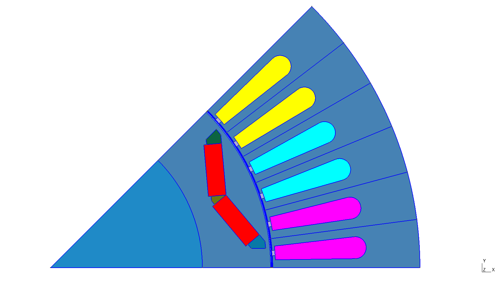

JSON-API
========

This section is about the PyEMMO JSON API.
It's working with two `JSON <https://de.wikipedia.org/wiki/JavaScript_Object_Notation>`_ formatted files, giving the geometry and the additional machine information.
You can call the API via the command line using the following command:

.. code:: shell

   $ python -m pyemmo.api.json /path/to/geo.json /path/to/machineInfo.json

Command-line Interface
----------------------

.. role:: bash(code)
   :language: bash

You can call :bash:`python -m pyemmo.api.json -h` to get the following information about the command line options:

.. You MUST add a empty line between the 'code-block' directive and the actual code you want to display.
.. using the code-block-"role" without syntax highlighting (-> "text")
.. code-block:: text

   usage: json.py [-h] [--gmsh GMSH] [--getdp GETDP] [--mod MOD] [--res RES] geo extInfo

   Process Motor-JSON files to generate a Onelab Simulation.

   positional arguments:
      geo            path to the JSON geometry file ('geometry.json')
      extInfo        path to the extended info JSON file ('extendedInfo.json')

   optional arguments:
      -h, --help     show this help message and exit
      --gmsh GMSH    path to the Gmsh executable
      --getdp GETDP  path to the GetDP executable
      --mod MOD      path where the model files should be stored
      --res RES      path where the simulation results should be stored

The arguments `gmsh`, `getdp`, `mod` and `res` are optional. If you don't specify the paths for Gmsh or GetDP, the program will try to find them in the system path.
The default path for the model result files (`mod` path) is a new folder in the user directory created at install time.
For Windows this will be something like :file:`C:/Users/USER_NAME/AppData/Roaming/pyemmo/Results`.
By default the results directory for the simulation results will be stored in the same folder as the onelab simulation files created by PyEMMO. The folder name defaults to :file:`/res_MODEL_NAME`.

.. _table-label:

.. table:: Simulation parameter in the JSON file.

   +-----------------+-----------------------------+-----------------+
   | parameter       | description                 | format          |
   | name            |                             |                 |
   +=================+=============================+=================+
   | winding         | winding layout              | List of str     |
   |                 | for given geometry          |                 |
   +-----------------+-----------------------------+-----------------+
   | NpP             | number of parallel paths per| int             |
   |                 | winding phase               |                 |
   +-----------------+-----------------------------+-----------------+
   | z_pp            | number of pole pairs        | int             |
   +-----------------+-----------------------------+-----------------+
   | Qs              | number of stator slots      | int             |
   +-----------------+-----------------------------+-----------------+
   | movingband_r    | moving band radius in meter | float           |
   +-----------------+-----------------------------+-----------------+
   | axLen_S         | axial length of stator      | float           |
   +-----------------+-----------------------------+-----------------+
   | axLen_R         | axial length of rotor       | float           |
   +-----------------+-----------------------------+-----------------+
   | symFactor       | symmetry factor for model   | int             |
   +-----------------+-----------------------------+-----------------+
   | startPos        | start rotor position in °   | float           |
   +-----------------+-----------------------------+-----------------+
   | endPos          | end rotor position in °     | float           |
   +-----------------+-----------------------------+-----------------+
   | nbrSteps        | number of time steps for    | int             |
   |                 | simulation                  |                 |
   +-----------------+-----------------------------+-----------------+
   | rot_freq        | rotational frequency in Hz  | float           |
   +-----------------+-----------------------------+-----------------+
   | parkAngleOffset | park transfomation offset   | float           |
   |                 | angle in elec. °            |                 |
   +-----------------+-----------------------------+-----------------+
   | analysisType    | 0 = static;                 | 0 or 1          |
   |                 | 1 = transient               |                 |
   +-----------------+-----------------------------+-----------------+
   | tempMag         | magnet temperature °C       | float           |
   +-----------------+-----------------------------+-----------------+
   | r_z             | tooth radius in meter       | float           |
   +-----------------+-----------------------------+-----------------+
   | r_j             | yoke radius in meter        | float           |
   +-----------------+-----------------------------+-----------------+
   | id              | d-axis current in A         | float           |
   +-----------------+-----------------------------+-----------------+
   | iq              | q-axis current in A         | float           |
   +-----------------+-----------------------------+-----------------+
   | modelName       | name of the model files     | string          |
   +-----------------+-----------------------------+-----------------+
   | magDirection    | | magnetization direction/  | string          |
   |                 |   type of permament magnets |                 |
   |                 | | ("parallel", "radial"     |                 |
   |                 |   or "tangential")          |                 |
   +-----------------+-----------------------------+-----------------+
   | flag_openGUI    | open Gmsh GUI after model   | bool            |
   |                 | generation                  |                 |
   +-----------------+-----------------------------+-----------------+
..   | flag_openGUI    | open Gmsh GUI after model   | bool            |
..   |                 | generation                  |                 |
..   +-----------------+-----------------------------+-----------------+
.. TODO: Update simulation parameters automatically

.. +-----------------+-----------------------------+-----------------+
.. | cuFillFactor    | copper fill symFactor       | float           |
.. +-----------------+-----------------------------+-----------------+
.. | R_S             | phase resistance in Ohm     | float           |

Here is an example of how the `extInfo` JSON file content could look like.
There can be more infos like the copper fill factor or the stator resistance, which will be used in the future.

.. code:: json

   {
      "winding": ["+u","+u","+u","-v","-v","-v","+w","+w","+w"],
      "NpP": 2,
      "Ntps": 25,
      "cuFillFactor": 0.5,
      "R_S": 0.75,
      "z_pp": 2,
      "Qs": 36,
      "movingband_r": 0.032,
      "axLen_S": 0.05,
      "axLen_R": 0.05,
      "symFactor": 4,
      "startPos": 0,
      "endPos": 90,
      "nbrSteps": 18,
      "rot_freq": 16.666666666666668,
      "parkAngleOffset": null,
      "analysisType": 0,
      "tempMag": 20,
      "r_z": 0.038,
      "r_j": 0.0475,
      "id": 0,
      "iq": 0,
      "modelName": "Example_Maschine",
      "magDirection": "parallel",
      "flag_openGUI": true
   }

.. TODO: Add information about geometry file format and identifiers

.. note::

   Here we will need to add some documentation about the format of the geometry
   definition and the important identifiers defined in:

   .. automodule:: pyemmo.api.json
      :members:
      :undoc-members:
      :show-inheritance:

   

json module
-----------

.. automodule:: pyemmo.api.json.json
   :members:
   :undoc-members:
   :show-inheritance:

importJSON module
-----------------

.. automodule:: pyemmo.api.json.importJSON
   :members:
   :undoc-members:
   :show-inheritance:

modelJSON module
----------------

.. automodule:: pyemmo.api.json.modelJSON
   :members:
   :undoc-members:
   :show-inheritance:

boundaryJSON module
-------------------

.. automodule:: pyemmo.api.json.boundaryJSON
   :members:
   :undoc-members:
   :show-inheritance:

create_airgaps module
---------------------
Here is an example for the workflow described in :func:`~pyemmo.api.json.create_airgaps.create_airgap_surfaces` using the Toyota Prius model of Pyleecan. See the function description for a more detailed explanation.

   
   ONELAB model of Toyota Prius machine in Gmsh created by PyEMMO.

1. Extract the boundary lines.
   
   .. image:: ../images/create_airgaps/prius_stator_boundary.png
      :scale: 30 %
      :alt: Final Prius Model with symmetry of 8.
      :align: center

2. Filter the lines on the symmetry axis.
   
   .. image:: ../images/create_airgaps/prius_stator_boundary_without_sym_axis.png
      :scale: 30 %
      :alt: Final Prius Model with symmetry of 8.
      :align: center

3. Find the point thats closest to the airgap on the x-axis.
   
   .. image:: ../images/create_airgaps/prius_stator_boundary_closestPoint.png
      :scale: 30 %
      :alt: Final Prius Model with symmetry of 8.
      :align: center

4. Find the interface curves connecting to that point.
   
   .. image:: ../images/create_airgaps/prius_stator_airgap_interface.png
      :scale: 30 %
      :alt: Final Prius Model with symmetry of 8.
      :align: center

5. Create the airgap surface(s) depending on if the found contour is purely cylindrical.
   For this stator the interface found is not cylindrical because of the slot openings.
   Thats why two airgap surfaces are created (one closing the stator interface and one
   purely cylindrical).
   
   .. image:: ../images/create_airgaps/prius_stator_airgaps.png
      :scale: 30 %
      :alt: Final Prius Model with symmetry of 8.
      :align: center

   .. image:: ../images/create_airgaps/prius_stator_airgaps_zoomed.png
      :scale: 30 %
      :alt: Final Prius Model with symmetry of 8.
      :align: center

.. automodule:: pyemmo.api.json.create_airgaps
   :members:
   :undoc-members:
   :show-inheritance:

.. Module contents
.. ---------------

.. .. automodule:: pyemmo.api
..    :members:
..    :undoc-members:
..    :show-inheritance:
