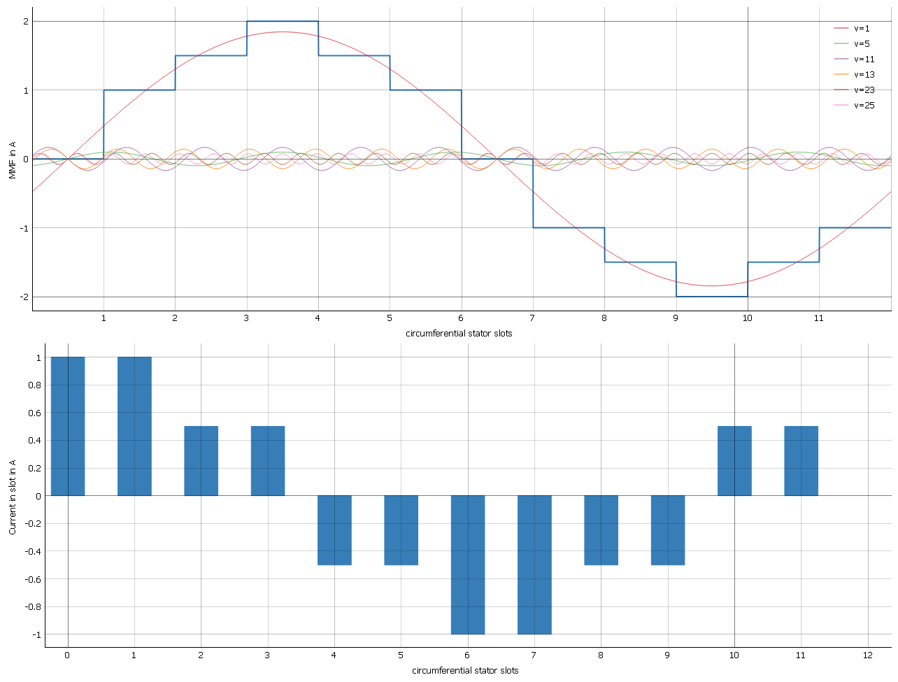
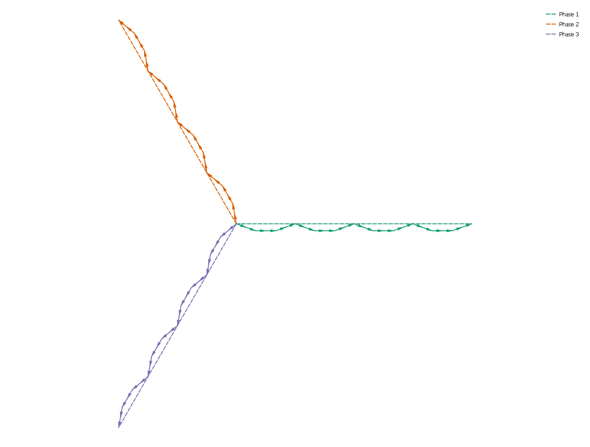
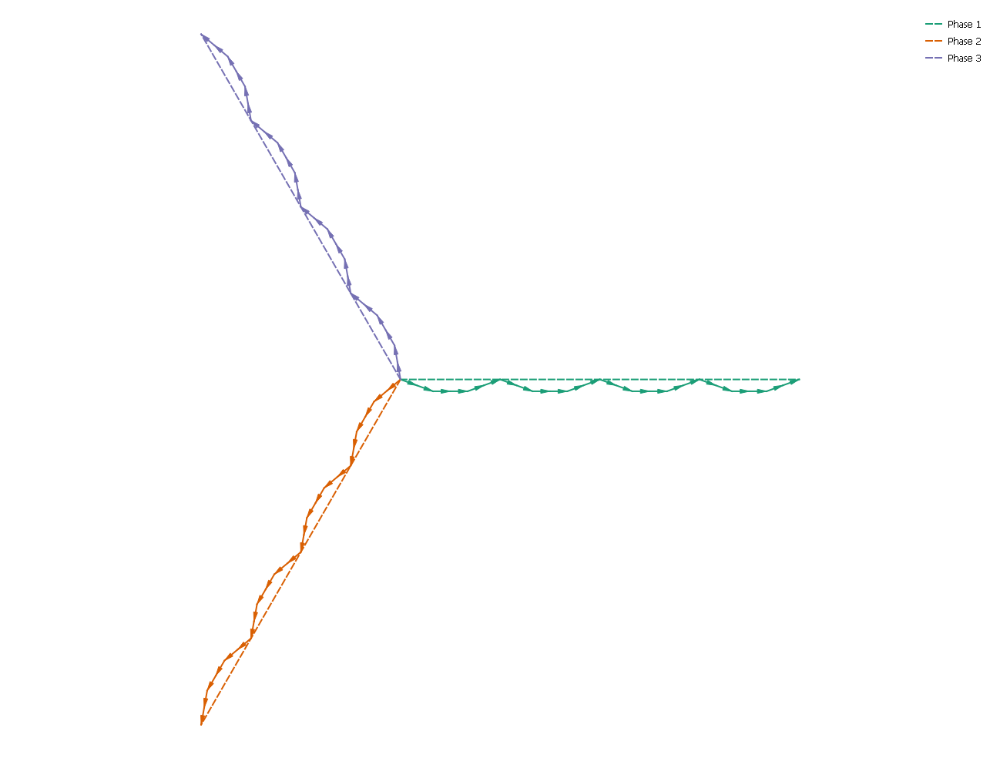

script package
==============

Geometry and Material package
-----------------------------

.. toctree::
   :maxdepth: 1

   pyemmo.script.geometry
   pyemmo.script.gmsh
   pyemmo.script.material

Script module
-------------

.. automodule:: pyemmo.script.script
   :members:
   :undoc-members:
   :show-inheritance:

dq-Offset calculation
---------------------

The determination of the dq-system offset angle is based on the calculation of the magneto motive force (MMF) waves by the `SWAT-EM <https://swat-em.readthedocs.io/en/latest/index.html>`_ package.
Here the MMF is calculated for a current distribution of :math:`I_{\mathrm{U}} = +I` and :math:`I_{\mathrm{V}} = I_{\mathrm{W}} = -\frac{I}{2}`, which should result in a positive d-Current once the dq-system is aligned with the uvw-system (u-axis aligned with d-axis at :math:`t = 0\,\mathrm{s}`).

   example MMF report by SWAT-EM for single layer winding with :math:`Q=12` and :math:`pp=1`

To get the current system offset, the cosine phase of the MMF wave whose order is corresponding to the number of pole pairs in the machine is evaluated.

.. math::
   \phi(MMF(\nu = pp))

For the simple 12-2 winding in the example picture this would be the wave with order :math:`\nu = 1` and results in a offset of -105° (electrical = mechanical angle, because number of pole pairs is 1).
Rotating the system by this angle alignes the wave with the first slot center (definition by SWAT-EM).
Since the model in PyEMMO by definition allways starts with a tooth center on the x-axis we need to further rotate by half a slot pitch (in electrical degrees: :math:`-\frac{1}{2} \frac{360°}{Q} \cdot pp`).
In the example this would result in :math:`-\frac{1}{2} \frac{360°}{12} \cdot 1 = -15°`.
Now the system would be align with the x-axis.
To align it with the first pole (which must be a north pole by this definition), the system must be shifted by +90° electrical, which results in the final dq-system offset angle:

.. math::
   \theta_{dq} = \phi(MMF(\nu = pp)) - \frac{1}{2} \frac{360°}{Q} \cdot pp + 90°

Winding rotation direction determination
----------------------------------------

To ensure that rotor and stator field are allways rotating in the same direction, the rotation direction of the resulting field wave of the stator winding must be determined.
This is done by evaluating the sign of the winding factor refering to the first electrical harmonic of that winding.
The winding factors are calculated with the `SWAT-EM <https://swat-em.readthedocs.io/en/latest/index.html>`_ package.
Here the sign of the winding factor will be determined by the order of the phase voltage vectors in the "star of slots".
The sign of the winding factor is positive if the phase vector next to phase 1 in mathematical positive direction (counter clock wise) is the vector of phase 2, otherwise the sign of the winding factor for this harmonic will be negative.
For more information about the winding factor calculation see `SWAT-EM documentation <https://swat-em.readthedocs.io/en/latest/theory.html#winding-factor>`_.

In the two following figures the star of slots for two winding configuration can be compared.
The first figure indicated a math. positive rotating field wave, since the resulting phase voltage vectors are in correct order (Phase 1, Phase 2, Phase 3).
The second figure is derived from the same winding configuration but with inverted phase order. This way the resulting phase voltage vectors for phase 2 and 3 are swaped (Phase 1, Phase 3, Phase 2) and the sign of the winding factor is negative.

   example star of slots by SWAT-EM for winding with normal phase order (:math:`Q=36`, :math:`pp=2`)

   example star of slots by SWAT-EM for winding with inverted phase order (:math:`Q=36` and :math:`pp=2`)

Written in code the rotation direction check looks like:

.. code:: python

   if machine.getStator().winding.get_windingfactor_el()[1][0, 0] < 0:
       simuParamDict.SYM.FLAG_CHANGE_ROT_DIR = 1
   else:
       simuParamDict.SYM.FLAG_CHANGE_ROT_DIR = 0

.. .. automodule:: pyemmo.script
..    :members:
..    :undoc-members:
..    :show-inheritance:
